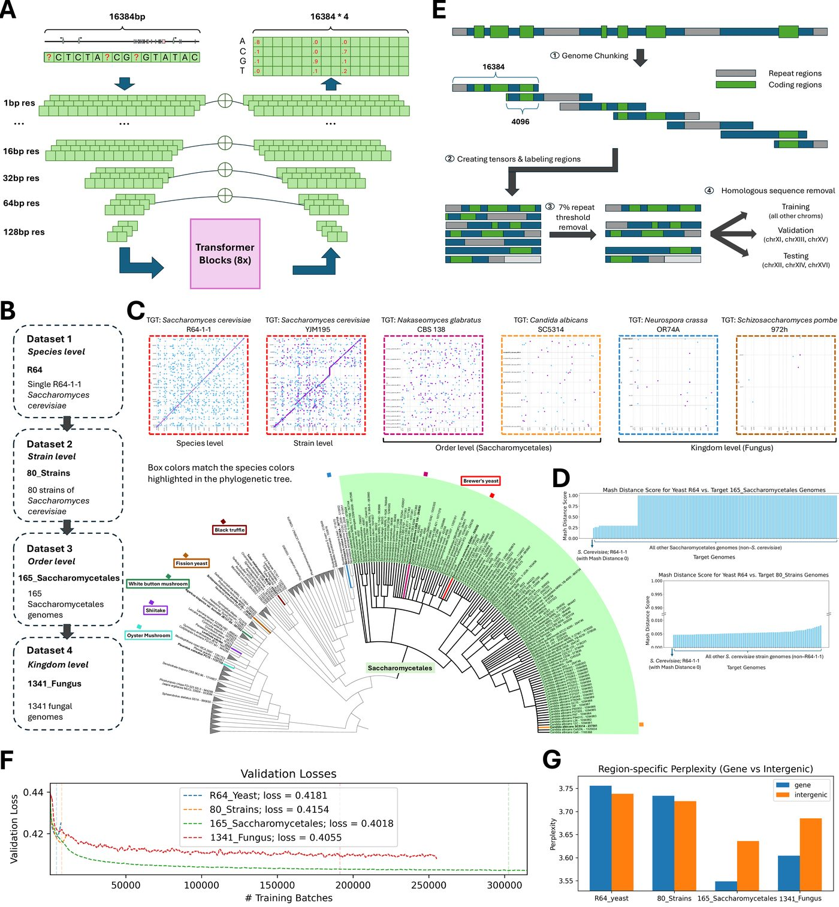
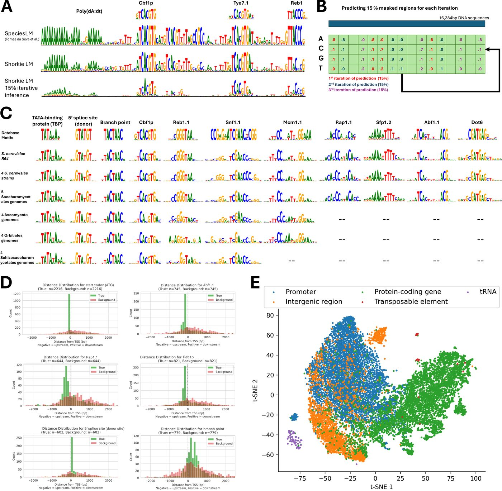
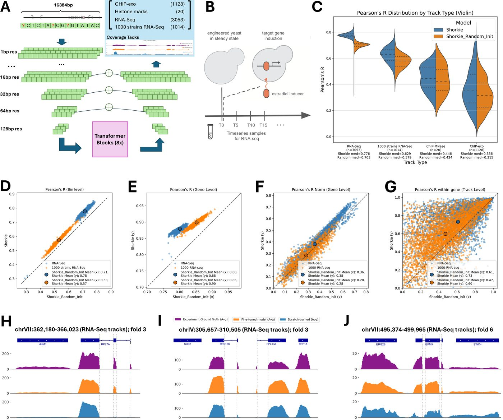
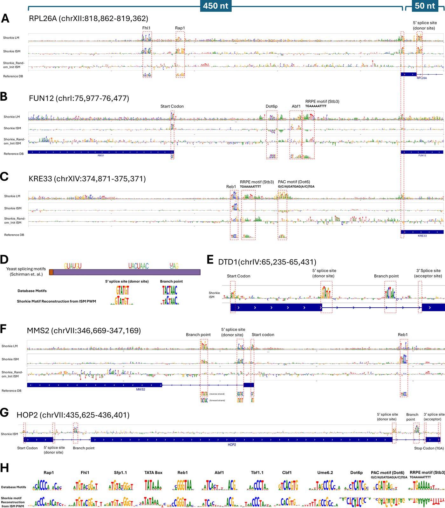
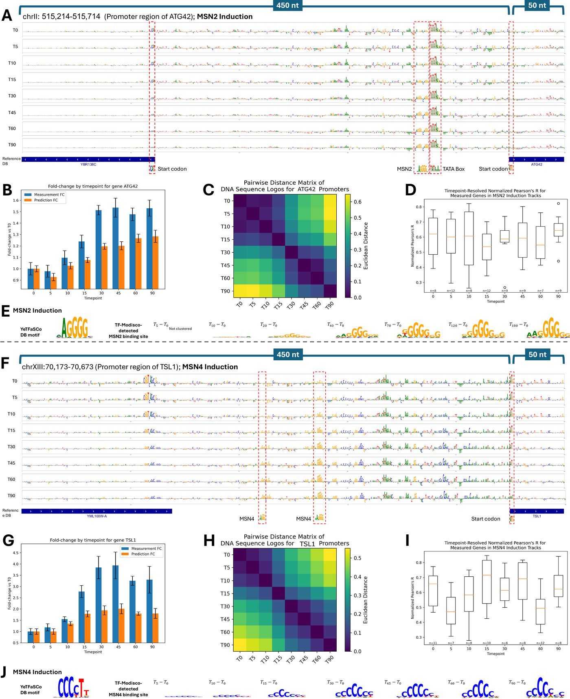
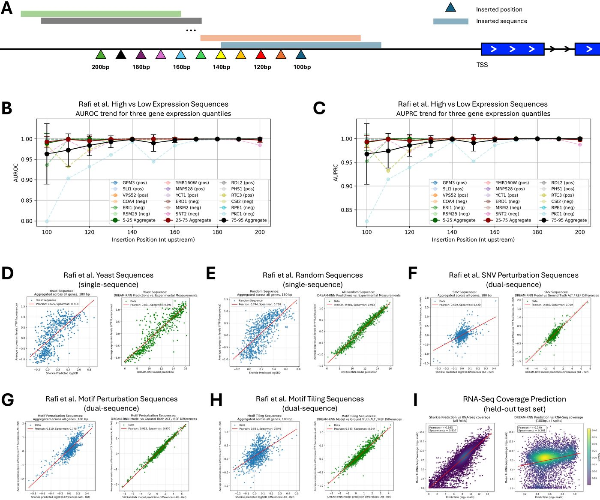
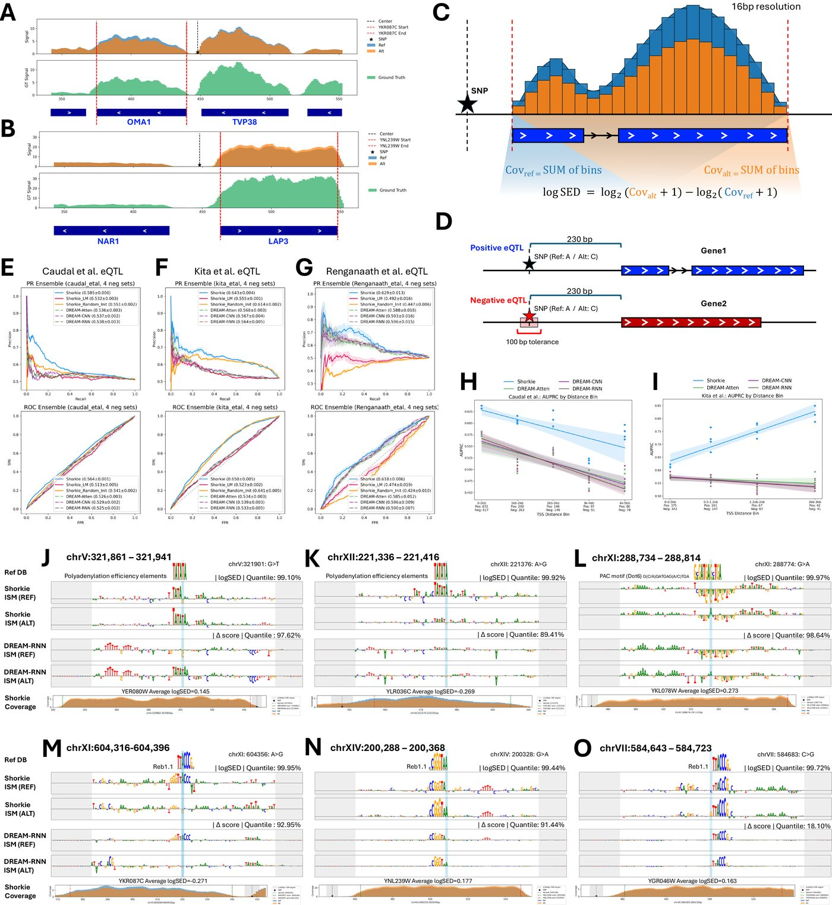

Analysis gallery
================

What Shorkie can do, one figure at a time. Each panel below is the published figure
from the paper; the notebook beside it regenerates that figure and checks the
regenerated numbers against the published ones.

Every notebook is executed and committed **with its outputs**, so you can read the
whole analysis — code, numbers and plots — without running anything. Click
**Notebook** to read it on GitHub, or **nbviewer** if GitHub's renderer is being slow.

.. note::

   The verification counts are not "the picture looks similar". Each figure ships a
   ``reproduced/verify_figNN.csv`` comparing published against regenerated values at
   ``rtol=0.02``. Across all seven figures that is **206 of 206 checks passing** —
   see :doc:`reproducing_figures`.

----

Figure 1 — The fungal corpus and the model
------------------------------------------

How the four pretraining corpora were built and how they relate phylogenetically —
the species tree, genome-to-genome alignment dotplots, Mash distances between
assemblies, and the language model's validation loss and perplexity as pretraining
proceeds. This is the "what did the model actually read" figure.

**12/12 checks** ·
`Notebook <https://github.com/calico/shorkie-paper/blob/main/notebooks/fig01_fungal_lm_corpus_architecture.ipynb>`__ ·
`nbviewer <https://nbviewer.org/github/calico/shorkie-paper/blob/main/notebooks/fig01_fungal_lm_corpus_architecture.ipynb>`__

----

Figure 2 — What the language model learned
-------------------------------------------

Motifs recovered from Shorkie_LM with TF-MoDISco — without ever being shown a motif
database. Includes the SMT3 promoter logo, the distribution of discovered motifs
relative to transcription start sites (they concentrate near TSSs, as real
regulatory elements should), and a t-SNE of the model's attention embeddings.

**21/21 checks** ·
`Notebook <https://github.com/calico/shorkie-paper/blob/main/notebooks/fig02_lm_conserved_motifs.ipynb>`__ ·
`nbviewer <https://nbviewer.org/github/calico/shorkie-paper/blob/main/notebooks/fig02_lm_conserved_motifs.ipynb>`__

----

Figure 3 — Predicting RNA-seq coverage
----------------------------------------

The core supervised result, and the cleanest statement of what pretraining bought:
**Shorkie vs Shorkie_Random_Init** across scales, from genome-wide correlation down
to individual gene loci. Gene-level RNA-seq Pearson R has a median of **0.771** for
Shorkie against **0.627** for the identically-trained model that started from random
weights.

**33/33 checks** ·
`Notebook <https://github.com/calico/shorkie-paper/blob/main/notebooks/fig03_supervised_rnaseq_prediction.ipynb>`__ ·
`nbviewer <https://nbviewer.org/github/calico/shorkie-paper/blob/main/notebooks/fig03_supervised_rnaseq_prediction.ipynb>`__

----

Figure 4 — Promoter and splicing motifs
-----------------------------------------

In-silico mutagenesis over ribosomal-protein and TSS-proximal windows, rendered as
per-base saliency logos. Mutating a base and measuring the predicted change recovers
recognisable promoter grammar and splice signals — evidence the model is keyed on
real regulatory sequence rather than position.

**38/38 checks** ·
`Notebook <https://github.com/calico/shorkie-paper/blob/main/notebooks/fig04_promoter_splicing_motifs.ipynb>`__ ·
`nbviewer <https://nbviewer.org/github/calico/shorkie-paper/blob/main/notebooks/fig04_promoter_splicing_motifs.ipynb>`__

----

Figure 5 — Dynamic induction time courses
-------------------------------------------

The "dynamic" in the title. Predicted versus measured expression across a
transcription-factor induction time course (MSN2/MSN4), including ISM at the ATG42
locus. Shorkie tracks how expression *changes over time* after induction, not just a
static steady-state level.

**10/10 checks** ·
`Notebook <https://github.com/calico/shorkie-paper/blob/main/notebooks/fig05_timecourse_tf_induction.ipynb>`__ ·
`nbviewer <https://nbviewer.org/github/calico/shorkie-paper/blob/main/notebooks/fig05_timecourse_tf_induction.ipynb>`__

----

Figure 6 — MPRA variant effects
---------------------------------

Shorkie scored against the Random Promoter DREAM Challenge MPRA — 71,103 held-out
promoters spanning native sequences, random oligos, high- and low-expression designs,
"challenging" sequences, and SNV/motif perturbations — compared with the DREAM-RNN
baseline. **Reproduces entirely on CPU from released data.**

**26/26 checks** ·
`Notebook <https://github.com/calico/shorkie-paper/blob/main/notebooks/fig06_mpra_variant_effects.ipynb>`__ ·
`nbviewer <https://nbviewer.org/github/calico/shorkie-paper/blob/main/notebooks/fig06_mpra_variant_effects.ipynb>`__

----

Figure 7 — cis-eQTL variant effects
-------------------------------------

The variant-effect benchmark on real natural variation: 1,901 eQTLs from Caudal
*et al.*, 683 from Kita *et al.*, and 142 MPRA-validated core-promoter variants from
Renganaath *et al.*, each against matched negative sets, plus ISM saliency at
individual eQTLs. This is the figure behind the ``logSED`` metric you get from
:doc:`shorkie_usage`. **Reproduces on CPU from released data.**

**66/66 checks** ·
`Notebook <https://github.com/calico/shorkie-paper/blob/main/notebooks/fig07_eqtl_variant_effects.ipynb>`__ ·
`nbviewer <https://nbviewer.org/github/calico/shorkie-paper/blob/main/notebooks/fig07_eqtl_variant_effects.ipynb>`__

----

Running them yourself
---------------------

Figures 6 and 7 run end to end on CPU from released data:

.. code-block:: bash

   data/download.sh --eqtl -u <your-gcp-project>
   data/download.sh --mpra all -u <your-gcp-project>
   jupyter lab notebooks/

The others need a gated intermediate produced by the cited ``scripts/`` stage. See
:doc:`reproducing_figures` for what each notebook requires, and :doc:`data_resources`
for how to obtain it.

Looking for usage examples rather than paper figures? The four short
`examples/ <https://github.com/calico/shorkie-paper/tree/main/examples>`__ notebooks
cover loading, inference and variant scoring — see :doc:`shorkie_usage` and
:doc:`shorkie_lm_usage`.
